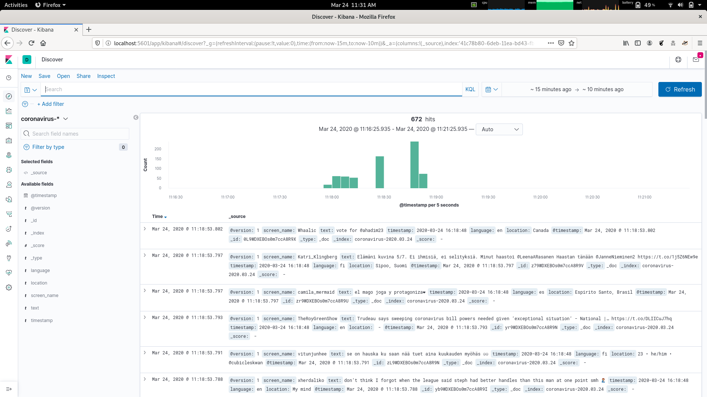
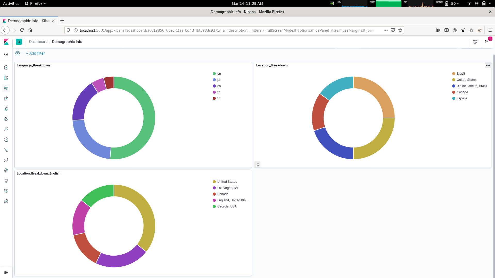

# TweetAnalyzer
An environment for analyzing Twitter

### Stream and Store Tweets in Real Time

Stream tweets based on keywords used, or the user accounts they are from. The tweets and their relevant information end up searchable in Kibana! 

### Use Dashboards in Kibana to Support Visualization

### Dependencies
- Linux Host Machine
- Docker
- Python3
