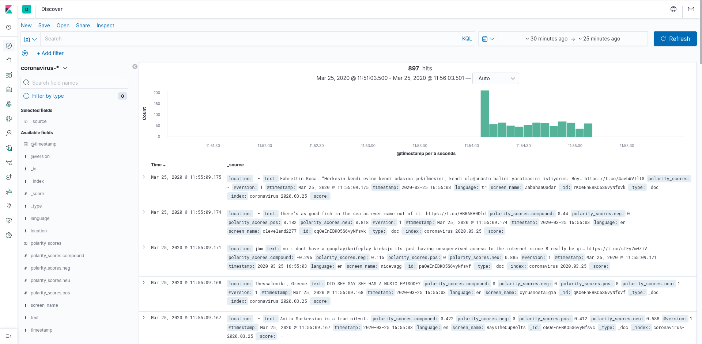
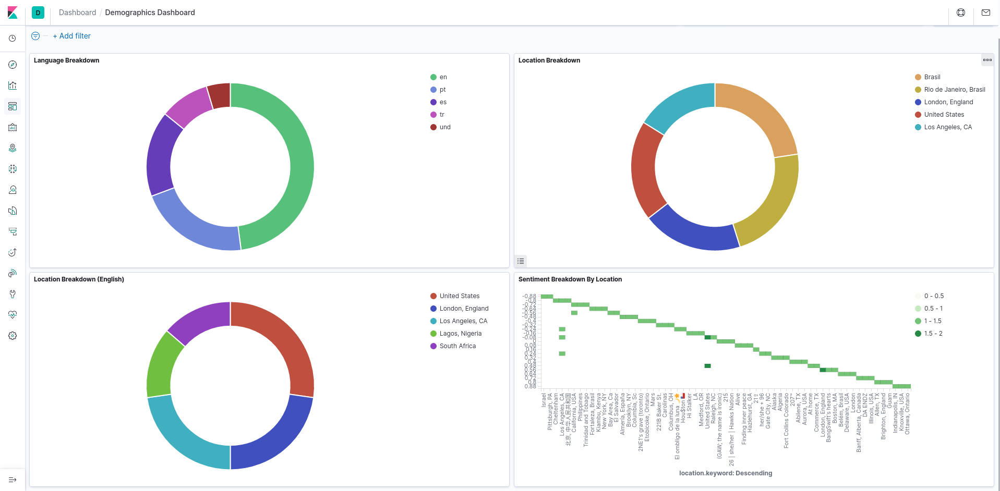
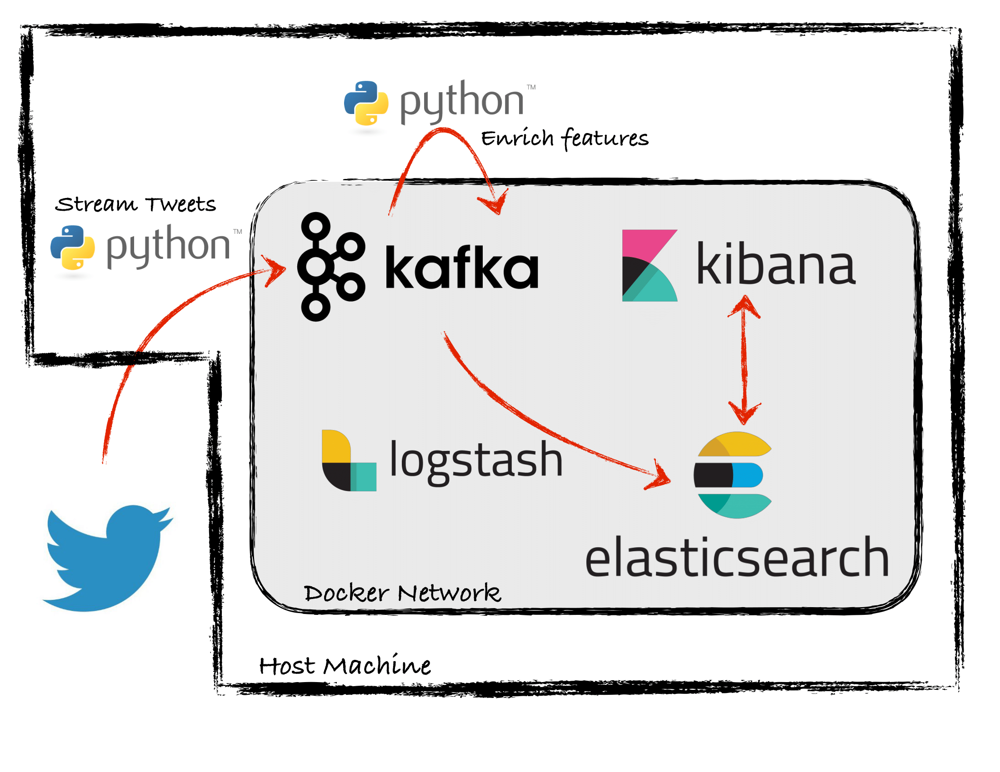

# TweetAnalyzer

### Stream and Store Tweets in Real Time

Stream tweets based on keywords used, or the user accounts they are from. The tweets and their relevant information end up searchable in Kibana! 

### Use Dashboards in Kibana to Support Visualization

### Architecture Overview
TweetAnalyzer uses a containerized ELK stack, plus Kafka to serve as an intermediate buffer for holding raw and processed tweet data.

### Dependencies
- Linux Host Machine
- Docker
- Python3
